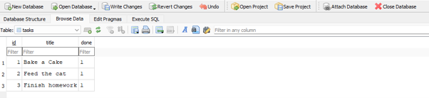
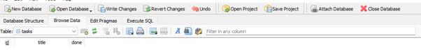
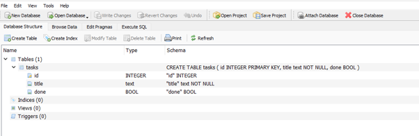
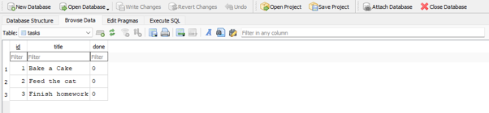
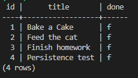
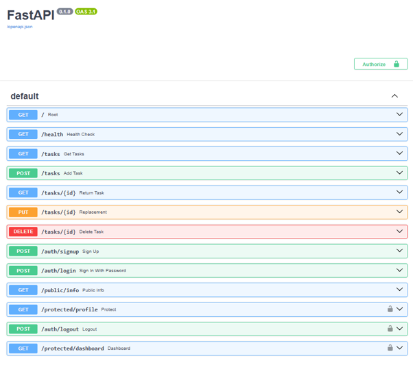
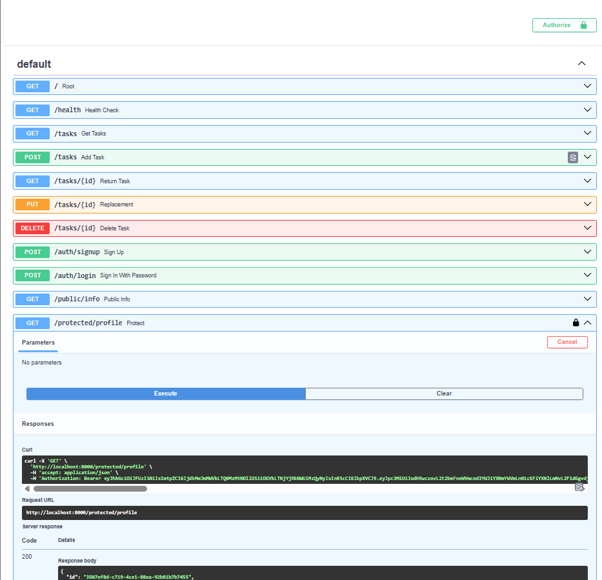
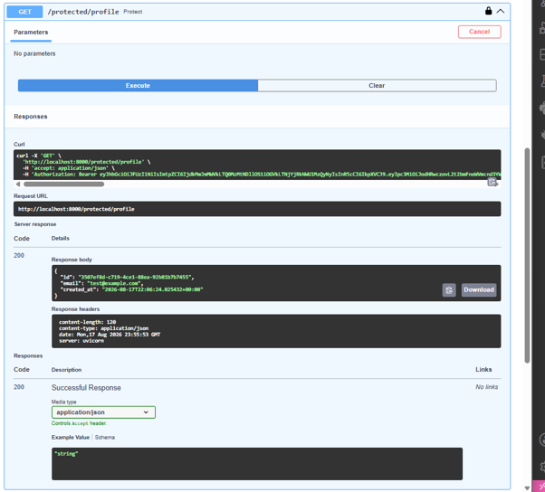

# First-CRUD-API-FlyRank

# Week 2
## What is it!

This is a RESTful API built using Python and FastAPI that manages a to-do list in memory. This project implements CRUD (Create, Read, Update, Delete) operations with request validation.

---

## How to Install & Run

1. Activate your virtual environment.
2. Run the following command to start the server:
   ```bash
   uvicorn main:app --reload --port 8000
   ```
   *You can access the interactive docs at `http://localhost:8000/docs`.*

---

## API Endpoints

| HTTP Method | Endpoint | Description | Status Code |
| :--- | :--- | :--- | :--- |
| **GET** | `/` | API Metadata | `200 OK` |
| **GET** | `/health` | Server Health Check | `200 OK` |
| **GET** | `/tasks` | List all tasks | `200 OK` |
| **GET** | `/tasks/{id}` | Retrieve a single task by ID | `200 OK` / `404 Not Found` |
| **POST** | `/tasks` | Create a new task | `201 Created` / `400 Bad Request` |
| **PUT** | `/tasks/{id}` | Update task title and completion status | `200 OK` / `400 Bad Request` / `404 Not Found` |
| **DELETE** | `/tasks/{id}` | Delete a task by ID | `204 No Content` / `404 Not Found` |

---

## Sample `curl -i` Output

**Command:**
```powershell
curl.exe -i -X POST http://localhost:8000/tasks -H "Content-Type: application/json" -d "{\"title\":\"Buy milk\"}"
```

**Response:**
```http
HTTP/1.1 201 Created
date: Mon, 03 Aug 2026 21:14:02 GMT
server: uvicorn
content-length: 40
content-type: application/json

{"id":5,"title":"Buy milk","done":false}
```

---

## Swagger UI Screenshot


# Week 3
## Stage 4: Exploring SQLite by hand

Ran this is DB Browser:
```sql
DELETE FROM tasks WHERE done = 1;
```
Before running, every task had 'done = 1' in the table, so after running, this deleted all the tasks causing the API to return '[]'.




## Why SQLite

SQLite was chosen as it doesn't require a server and only produces a single file.

## Where the DB file lives

This is automatically created on startup. The file itself, tasks.db, has be placed into a .gitignore file so that every clone produced starts fresh

## A documented command to run the project

uvicorn main:app --reload

## Screenshot of database open in DB browser




## A3 - Postgres in Docker

This created Postgres container with a volume so its data persists

\```bash
docker run --name taskdb -e POSTGRES_PASSWORD=dev -e POSTGRES_DB=tasks -p 5432:5432 -v taskdata:/var/lib/postgresql/data -d postgres:16
\```

## Applying a containerized Postgres stack
A task CRUD API that runs against a PostgreSQL database, fully containerized with Docker Compose.

## Command to run everything 

1. Copy the example environment file:
   \```
   cp .env.example .env
   \```
2. Start the whole stack:
   \```
   docker compose up
   \```
3. The API is available at http://localhost:8000

## Which variables to set

Refer to  `.env.example` for the required format. Copy it to `.env` — the default values work out of the box with `docker compose up`.

## Table with Endpoints

| Method | Endpoint       | Description                           |
|--------|----------------|---------------------------------------|
| GET    | /root          | Defines route for root URL of the API |
| GET    | /health        | Gets health status                    |
| GET    | /tasks         | List all tasks                        |
| GET    | /tasks/{id}    | Get one task                          |
| POST   | /tasks         | Create a task                         |
| PUT    | /tasks/{id}    | Update a task                         |
| DELETE | /tasks/{id}    | Delete a task                         |

## curl -i
\```
curl.exe -i http://localhost:8000/tasks
HTTP/1.1 200 OK
date: Sun, 09 Aug 2026 18:52:19 GMT
server: uvicorn
content-length: 187
content-type: application/json

[{"id":1,"title":"Bake a Cake","done":false},{"id":2,"title":"Feed the cat","done":false},{"id":3,"title":"Finish homework","done":false},{"id":4,"title":"Persistence test","done":false}]
\```

## Screenshot of data in the database



# Week 4 
## A4 — Auth (Supabase)

This week we've added user authentication to the API using Supabase. Users can sign up, log in, and log out, and certain routes are now protected with JWT verification — they only respond to requests carrying a valid access token.

### Run the project

\```
uvicorn main:app --reload
\```

The API is available at http://localhost:8000, with interactive docs (including the Swagger "Authorize" flow) at http://localhost:8000/docs.

### Auth Endpoints

| Method | Endpoint              | Description                           | Auth required |
|--------|-----------------------|---------------------------------------|----------------|
| POST   | /auth/signup          | Creates a new user account            | No             |
| POST   | /auth/login           | Log in and returns access token       | No             |
| POST   | /auth/logout          | End user's session                    | Yes            |
| GET    | /protected/profile    | Read private profile data             | Yes            |
| GET    | /protected/dashboard  | Second protected route for dashboard  | Yes            |
| GET    | /public/info          | Public data                           | No             |

### Setup

In addition to `DATABASE_URL`, this project needs two Supabase keys in your `.env`:
\```
SUPABASE_URL=your_project_url
SUPABASE_KEY=your_anon_key
\```
Please see `.env.example` for the full list.

### Swagger UI



