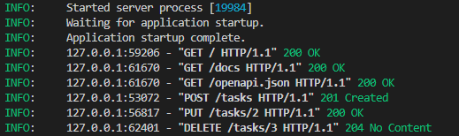

# First-CRUD-API-FlyRank
Week 2

## What is it!

This is a RESTful API built using Python and FastAPI that manages a to-do list in memory. This project implements CRUD (Create, Read, Update, Delete) operations with request validation.

---

## How to Install & Run

1. Activate your virtual environment.
2. Run the following command to start the server:
   ```bash
   uvicorn main:app --reload --port 8000
   ```
   *You can access the interactive docs at `http://localhost:8000/docs`.*

---

## API Endpoints

| HTTP Method | Endpoint | Description | Status Code |
| :--- | :--- | :--- | :--- |
| **GET** | `/` | API Metadata | `200 OK` |
| **GET** | `/health` | Server Health Check | `200 OK` |
| **GET** | `/tasks` | List all tasks | `200 OK` |
| **GET** | `/tasks/{id}` | Retrieve a single task by ID | `200 OK` / `404 Not Found` |
| **POST** | `/tasks` | Create a new task | `201 Created` / `400 Bad Request` |
| **PUT** | `/tasks/{id}` | Update task title and completion status | `200 OK` / `400 Bad Request` / `404 Not Found` |
| **DELETE** | `/tasks/{id}` | Delete a task by ID | `204 No Content` / `404 Not Found` |

---

## Sample `curl -i` Output

**Command:**
```powershell
curl.exe -i -X POST http://localhost:8000/tasks -H "Content-Type: application/json" -d "{\"title\":\"Buy milk\"}"
```

**Response:**
```http
HTTP/1.1 201 Created
date: Mon, 03 Aug 2026 21:14:02 GMT
server: uvicorn
content-length: 40
content-type: application/json

{"id":5,"title":"Buy milk","done":false}
```

---

## Swagger UI Screenshot

